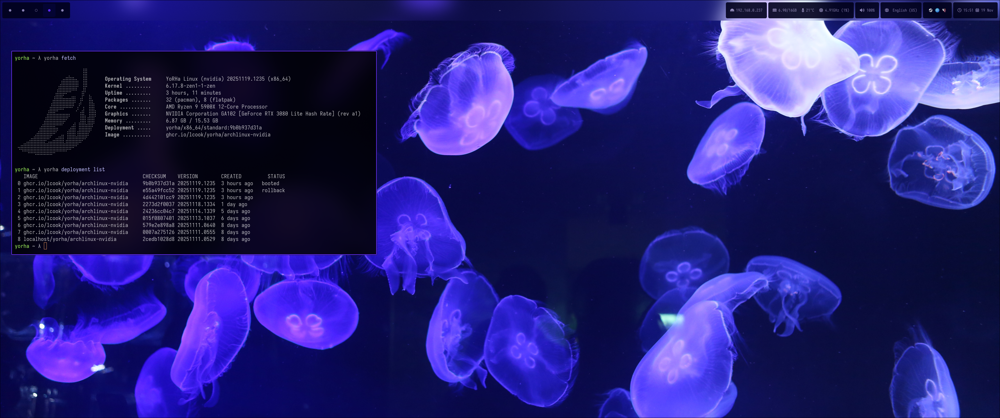

<p align="center">
  <b>YoRHa</b> (寄葉) "passing leaf" —  Immutable Arch Linux distribution with OSTree</center>
  <br>
  <br>
  <a href="https://github.com/lcook/yorha/actions/workflows/publish-images.yaml">
    </img>
  </a>
</p>

- [Overview](#overview)
- [Design philosophy](#design-philosophy)
- [Installation](#installation)
- [Development](#development)
    - [Flavors](#flavors)
- [Tentative goals](#tentative-goals)
- [Credits](#credits)
- [License](#license)




_Complimentary blog post can be found [here](https://www.lcook.net/notes/yorha/)_.

### Overview

This repository provides a toolkit for building and deploying OSTree-based Linux distributions. While Arch Linux is the default base,
it is possible to use alternative distributions like Debian, Fedora, Alpine and friends simply by adding them under [base](base)
(see [archlinux](base/archlinux) for reference). However, please note that effort currently focuses exclusively on Arch Linux.

### Design philosophy

YoRHa is built around the concept of an atomic desktop: where the core system is kept minimal, immutable, and read-only. This approach enables
reproducible deployments and versioned rollbacks, making upgrades and recoveries simple and dependable through OSTree. The root filesystem is
created via containers, ensuring a clean and consistent environment each time, and each deployment performs a factory reset of the system
configuration (unless overridden).

Graphical applications are installed via Flatpak whenever possible providing isolation and easy updates. Developers and power users can utilise `toolbox`
containers for command-line tools and development environments, keeping the base system uncluttered. This separation means your system, graphical, and
command-line workloads each operate in their own dedicated space.

At a higher level, the end system is comprised of:

* [OSTree](https://ostreedev.github.io/ostree): Atomic updates and rollback mechanism with a read-only, immutable root filesystem
* [Toolbox](https://containertoolbx.org): Disposable development containers
* [Flatpak](https://flatpak.org): Sandboxed application deployment for GUI software
* [Podman](https://podman.io): Containerised system image creation for OSTree deployments
* Arch Linux (by the way).

Upgrades are performed by building a new container image with `podman` or by using the provided GitHub container repository. If you hit a
problem, you can easily roll back to the previously working deployment.

> [!NOTE]
> Configuration files from my [dotfiles](https://github.com/lcook/dots) repository are copied to `/etc/skel` during image creation, so every
> new user account is automatically set up with a complete and consistent environment. You can of course swap these files with your own
> configurations if preferred.

### Installation

It is recommended to use a live environment such as the [Arch Linux ISO](https://archlinux.org/download/) to bootstrap YoRHa to a drive. The following instructions
are based on this setup; if you use a different system, the process or results may differ.

1. **Install the necessary dependencies** needed to bootstrap a system:

```console
# pacman --noconfirm -Sy git ostree podman
```

2. **Clone this repository** on a live system:

```console
# git clone --recursive https://github.com/lcook/yorha /tmp/yorha
```

3. **Prepare the disk for bootstrapping** by running the below command. You will be prompted choose the target disk, which will
    then be automatically partitioned and formatted with XFS as the default filesystem. The setup creates three labeled
    partitions:
    - `SYS_ROOT`: root filesystem (`/`)
    - `SYS_VAR`: persistent data (`/var`)
    - `SYS_BOOT`: EFI boot partition (`/boot/efi`)

> [!NOTE]
> Make sure to source the script to setup the environment variables correctly otherwise the bootstrap process will fail.

```console
# . ./yorha live prep-disk # You MUST source the script!
# ./yorha live init
```

4. **Deploy OCI containter image with OSTree** with one of two methods below:

<details open>

<summary>Pre-built GitHub Container Registry images (recommended for consumers)</summary>

Container images are built automatically by [GitHub Actions](.github/workflows/publish-images.yaml) and can be found
[here](https://github.com/lcook?tab=packages&repo_name=yorha) following each commit that passes
the build pipeline, in addition to weekly scheduled builds to prevent stale images accruing. You may replace <-flavor>
with the images detailed in [Flavors](#flavors).

```console
# ./yorha live install ghcr.io/lcook/yorha/archlinux<-flavor>
# systemctl reboot
```

After rebooting, you can upgrade your system whenever new container images are available in the container registry.
To check, run the following:

```console
$ sudo yorha upgrade remote
```

Viola - you are now up and running! This is the more "hands-off" approach towards configuring the system, meanwhile
the below grants the flexibility to do as you please with custom images.

</details>

<details>

<summary>Locally built images (recommended for development and custom images)</summary>

Alternatively, custom local images can be built and adapted to your liking. This can be helpful for situations
when you want to make local modifications to the deployed image not available in the provided image in the GitHub
Container Registry.

```console
# ./yorha compose container-base
# ./yorha compose container
# ./yorha compose flavor <flavor> # Optional
# ./yorha live install
# systemctl reboot
```

This will build both the [base image](base/archlinux/Containerfile) and then atop any custom settings or tweaks
found [here](base/archlinux/Containerfile.yorha). To make additions after the initial bootstrapping phase,
please read [Development](#development).

</details>

> [!NOTE]
> The default `root` account password is set to `ostree` - please change this after logging in!

### Development

For local development, it is suggested to clone this repository to your machine. By maintaining a local copy at
`~/dev/yorha` the version will override the system-installed libexec and yorha scripts (located in `/usr/libexec/yorha-*` and `/usr/bin/yorha`).

The fish shell configuration initially copied from `/etc/skel` into your home directory includes a check for the corresponding project directory
(see [this script](https://github.com/lcook/dots/blob/main/fish/functions/__yorha_env_start.fish)). If the directory exists, it sets `YORHA_BASE_PATH`
and `YORHA_LIBEXEC_PATH`; if it is absent, the `yorha` script falls back to the defaults defined in [yorha-config](libexec/yorha-config).

To get started, clone both the main repository and the accompanying dotfiles, then execute the helper scripts to apply the chosen theme and establish
the proper symlinks:

```console
$ git clone --recursive https://github.com/lcook/yorha ~/dev
$ git clone https://github.com/lcook/dots ~/dev && cdots
$ ./0-themer [theme]
$ ./1-symlinks
```

When modifying container images, update the files under [base/archlinux](base/archlinux) and rebuild the images by running:

```console
$ sudo yorha compose container-base  # Build the base Arch Linux container image
$ sudo yorha compose container       # Build the OSTree image with your customisations
$ sudo yorha compose flavor <flavor> # Optionally build flavor
$ sudo yorha upgrade local           # Deploy the updated container built image via OSTree
$ systemctl reboot
```

#### Flavors

Flavors are purpose-specific overlays for the base image that add hardware specific packages, configurations and tweaks during image creation. Flavors live under [base/archlinux/flavor](base/archlinux/flavor/).

Some provided images built:

- [ghcr.io/lcook/yorha/archlinux-nvidia](https://github.com/lcook/yorha/pkgs/container/yorha%2Farchlinux-nvidia): Adds packages/configurations commonly required for systems using NVIDIA GPUs
- [ghcr.io/lcook/yorha/archlinux-intel](https://github.com/lcook/yorha/pkgs/container/yorha%2Farchlinux-intel): Adds packages/configurations commonly required for systems using Intel integrated graphics.

These optionally can be built locally and deployed with the following:

```console
$ sudo yorha compose flavor archlinux-nvidia # Syntax for `compose flavor` is [base]-[flavor]
$ sudo yorha upgrade local # Deploy after build
```

### Tentative goals

* Refactor the `yorha` buildkit to leverage the [OSTree C API](https://ostreedev.github.io/ostree/reference/) replacing a handful of shell scripts, inspired by projects like `rpm-ostree`
* Expand support to include additional Linux distributions beyond Arch Linux
* Migrate to [bootc](https://github.com/bootc-dev/bootc) once [bootupd](https://github.com/coreos/bootupd) is better supported on non-Fedora systems.

### Credits

Special thanks to [GrabbenD](https://github.com/GrabbenD) ([ostree-utility](https://github.com/GrabbenD/ostree-utility)) for inspiration.

### License

[BSD 2-Clause](LICENSE)
