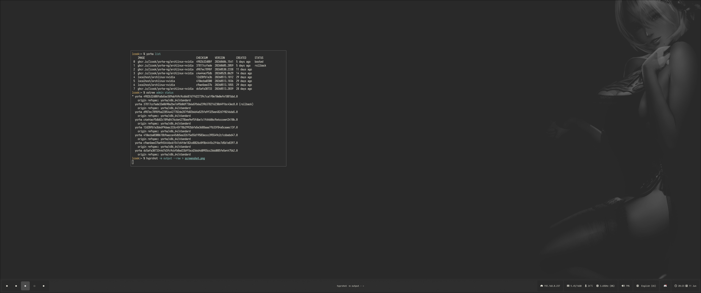

<p align="center">
  <b>YoRHa</b> - Immutable Arch Linux distribution built with OSTree</center>
  <br>
  <br>
  <a href="https://github.com/lcook/yorha/actions/workflows/build.yaml">
    </img>
  </a>
</p>



- [Overview](#overview)
- [Design philosophy](#design-philosophy)
- [Installation](#installation)
- [Maintenance](#maintenance)
- [Housekeeping](#housekeeping)
- [Images](#images)
- [Credits](#credits)
- [License](#license)

### Overview

This repository provides a toolkit for building and deploying OSTree-based Linux
distributions. While Arch Linux is the preferred base, it is possible to use
alternative distributions like Debian, Fedora, Alpine and friends simply by adding
them as another image under [config](config). However, _please note that effort
currently focuses exclusively on Arch Linux_.

### Design philosophy

YoRHa is built around the concept of an atomic desktop: where the core system is
kept minimal, immutable, and read-only. This approach enables reproducible deployments
and versioned rollbacks, making upgrades and recoveries simple and dependable through
OSTree. The root filesystem is created via container images, ensuring a clean and
consistent environment each time, and each deployment performs a factory reset of
the system configuration (unless overridden).

Graphical applications are installed via Flatpak whenever possible providing isolation
and easy updates. Developers and power users can utilise `toolbox` containers for
command-line tools and development environments, keeping the base system uncluttered.
This separation means your system, graphical, and command-line workloads each operate
in their own dedicated space.

At a higher level, the end system is comprised of:

* [OSTree](https://ostreedev.github.io/ostree): Atomic updates and rollback mechanism
  with a read-only, immutable root filesystem
* [Toolbox](https://containertoolbx.org): Disposable development containers
* [Flatpak](https://flatpak.org): Sandboxed application deployment for GUI software
* [Podman](https://podman.io): Containerised system image creation for OSTree deployments
* Arch Linux (by the way).

Upgrades are performed by pulling the newest container image built either locally
or provided by the GitHub container registry. If you hit a problem, you can easily
roll back to the previously working OSTree deployment.

> [!NOTE]
> Configuration files from my [dotfiles](https://github.com/lcook/dots) repository are 
> copied to `/etc/skel` during image creation, so every new user account is automatically
> set up with a complete and consistent environment. You can of course swap these
> files with your own configurations if preferred.

### Installation

A live environment such as the [Arch Linux ISO](https://archlinux.org/download/)
is recommended for bootstrapping YoRHa to a target disk. The following instructions
assume such an environment.

1. **Install the necessary dependencies and enable podman service** needed to bootstrap your system:

```console
# pacman --noconfirm -Sy git ostree podman fuse-overlayfs && systemctl start podman
```

2. **Download and run the installer** from the GitHub releases page:

```console
# curl -OL https://github.com/lcook/yorha/releases/latest/download/yorha-inst && chmod +x yorha-inst
# ./yorha-inst
```

After downloading and running the installer binary, you will be guided through an
interactive command-line installer that simplifies the process of setting up a live
system. The installation occurs in three stages: first, disk partitioning and formatting;
second, OSTree repository setup and imaging; and finally, OSTree deployment and bootloader
installation.

In stage two, you will be asked to enter a container image for deployment. You can
find available images [here](#images), and you also have the option to provide your own.
After all stages have completed you can reboot your system. You should be greeted with
[ly](https://codeberg.org/fairyglade/ly) as the login manager.

> [!NOTE]
> The default `root` account password is set to `ostree` - please change this after logging in!

### Maintenance

Container images are built automatically by [GitHub Actions](.github/workflows/build.yaml)
and can be found [here](https://github.com/lcook?tab=packages&repo_name=yorha) following
each commit that passes the build pipeline, in addition to weekly scheduled builds
to prevent stale images accruing. With that in mind, you can either use the provided
images or build your own (see below) to create new OSTree deployments.

<details open>

<summary>Pre-built GitHub Container Registry images (recommended for consumers)</summary>

Updating to the latest image can be done by running:

```console
# yorha update
```

It should automatically detect the booted OSTree environment and the corresponding
container image removing the need to use the `-i` flag. However, if you wish to
switch the image, you can do so by passing the `-i` flag followed by the container
image URL (for example, `ghcr.io/lcook/yorha/custom-image`). This will initiate a
new deployment.

This method of updating the system is the more hands-off approach, while the method
below allows for the flexibility to use custom images as you wish.

</details>

<details>

<summary>Locally built images (recommended for development and custom images)</summary>

You can also build and customize your own container images according to your preferences.
This approach is useful when you need to make local modifications to the deployed
image that are not available in the provided image in the GitHub Container Registry.

To get started clone the repository, add your custom config into the [config](config)
directory,  and build the toolkit:

```console
# git clone --recursive https://github.com/lcook/yorha && cd yorha
# make build # Builds binaries with all features enabled and not just a thin client
# ./yorha build -c config/image-custom.yaml
```

> [!NOTE]
> When building containers as an unprivileged user you may encounter an error
> saying that the podman socket does not exist. Start the service with
> `systemctl start --user podman.socket` and try again.

This will initiate a build by calling the Podman API after preparing the Containerfile
template as specified in the YAML file. Assuming the container name is `archlinux-custom`
and no issue occured during the build process, you can deploy the image:

```console
# ./yorha update -i localhost/archlinux-custom
```

Any subequent invokations to `yorha update` do not need `-i` as the image name will
automatically be detected.

</details>

> [!NOTE]
> Stale container images are automatically cleared up on update to help save on disk space.

### Housekeeping

List available OSTree deployments and their corresponding container image:

```console
# yorha list
    IMAGE                                    CHECKSUM     VERSION        CREATED      STATUS
 0  ghcr.io/lcook/yorha/archlinux-nvidia     4982b32d08f  20260606.1541  6 days ago   booted
 1  ghcr.io/lcook/yorha/archlinux-nvidia     37817ccfade  20260605.2059  6 days ago   rollback
 2  ghcr.io/lcook/yorha/archlinux-nvidia     d987ec7898f  20260530.2338  12 days ago
 3  ghcr.io/lcook/yorha/archlinux-nvidia     c4a44acf5db  20260528.0629  15 days ago
```

> [!NOTE]
> To remove a previous OSTree deployment, first identify its deployment index (in the output above,
> between 0 and 3, '2' will be used in this example). Then run `ostree admin undeploy 2`
> to delete that deployment and free up some space. You can repeat this process for as
> many valid deployments as you want to remove.

Switch the active OSTree deployment:

```console
# yorha switch
    IMAGE                                    CHECKSUM     VERSION        CREATED      STATUS
 0  ghcr.io/lcook/yorha/archlinux-nvidia     4982b32d08f  20260606.1541  6 days ago   booted
 1  ghcr.io/lcook/yorha/archlinux-nvidia     37817ccfade  20260605.2059  6 days ago   rollback
 2  ghcr.io/lcook/yorha/archlinux-nvidia     d987ec7898f  20260530.2338  12 days ago
 3  ghcr.io/lcook/yorha/archlinux-nvidia     c4a44acf5db  20260528.0629  15 days ago

* Select deployment index [0-3]:
```

### Images

| Image | Description |
|-------|-------------|
| [ghcr.io/lcook/yorha/archlinux-base](https://github.com/lcook/yorha/pkgs/container/yorha%2Farchlinux-base) | Base YoRHa container image built from Arch Linux |
| [ghcr.io/lcook/yorha/archlinux-mainline](https://github.com/lcook/yorha/pkgs/container/yorha%2Farchlinux-mainline) | Mainline YoRHa container image providing the core desktop and environment |
| [ghcr.io/lcook/yorha/archlinux-nvidia](https://github.com/lcook/yorha/pkgs/container/yorha%2Farchlinux-nvidia) | YoRHa container image with NVIDIA GPU support |
| [ghcr.io/lcook/yorha/archlinux-intel](https://github.com/lcook/yorha/pkgs/container/yorha%2Farchlinux-intel) | YoRHa container image with Intel GPU support |

Updates, removals and additions to the latest container images can be found [here](https://github.com/lcook/yorha/releases/latest).

### Credits

Special thanks to [GrabbenD](https://github.com/GrabbenD) ([ostree-utility](https://github.com/GrabbenD/ostree-utility)) for inspiration.

### License

[BSD 2-Clause](LICENSE)
